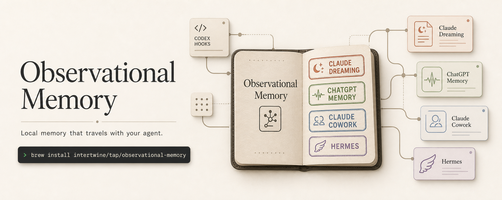
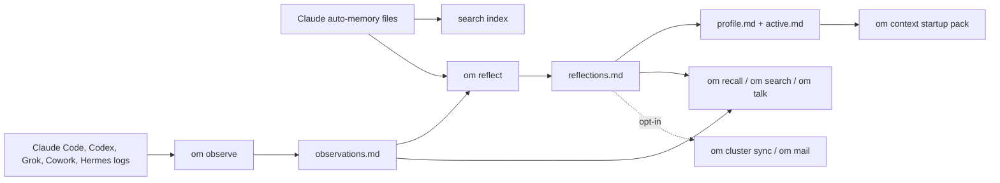
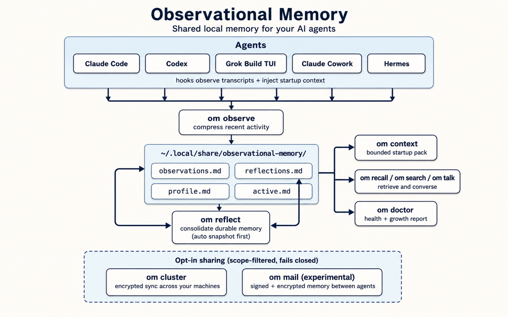

# Observational Memory



[](https://pypi.org/project/observational-memory/)
[](https://pypi.org/project/observational-memory/)
[](https://github.com/intertwine/observational-memory/actions/workflows/ci.yml)
[](https://github.com/intertwine/observational-memory/stargazers)

**One local memory for your AI coding agents — so every session starts knowing your work instead of starting over.**

Observational Memory, or `om`, watches what you do with Claude Code, Codex, Grok Build TUI, and Claude Cowork (Hermes joins through its [plugin](docs/hermes-plugin.md)), distills it into plain Markdown on your machine, and hands every new session a compact memory summary. What Claude learns today, Codex knows tomorrow.

- **No more cold starts.** Every session begins knowing who you are, how you work, and what you were doing.
- **One memory across agents.** Switch tools without losing context.
- **Your memory is yours.** Plain Markdown files on your machine — readable, searchable, backed up, never silently uploaded.

## New in v0.8.0

v0.7.0 made reflection scale. v0.8.0 makes memory **trustworthy**:

- **Durable** — `om backup` / `om restore`: host-local snapshots, plus an automatic safety snapshot before every reflection, so a bad write can always be rolled back.
- **Provable** — every memory section records when it was last derived and from which window of observations, so you always know how fresh it is and where it came from. Memory you mark machine-local (`scope=local`) never leaves your machine through any sharing channel — sync, cloud search, or mail — and unknown scopes are denied by default. `om reflect --check-conflicts` flags high-stakes facts a reflection cycle silently changed.
- **Conversational** — `om talk`: ask your memory questions in plain English and get answers grounded in live recall (experimental).
- Plus: `om doctor` and `om context --quality-report` now report how big and how cold each memory section is, so future pruning decisions are grounded in data.

And a sneak peek at where this is going: with **OM Mail (experimental)**, agents get their own email inboxes and exchange memory as signed messages — notes, encrypted context packs, and recall requests — across machines, harnesses, models, and vendors. Nothing is sent automatically: every exchange is a deliberate command, senders must be cryptographically pinned, and machine-local memory is filtered out before anything leaves. [See how it works](docs/mail-memory.md).

Everything is additive and defaults are unchanged. Full details: [v0.8.0 release notes](docs/RELEASE-0.8.0.md).

**Upgrading from 0.6.x or 0.7.x?**

```bash
brew upgrade observational-memory   # or: uv tool upgrade observational-memory
om doctor
```

No config changes needed. New surfaces (`om backup`, `om talk`, `om mail`, `--check-conflicts`) do nothing until you invoke them. One new background behavior: `om reflect` snapshots your memory before writing, with rotating retention bounding disk use.

## Quick Install

macOS with Homebrew:

```bash
brew install intertwine/tap/observational-memory
om install
om doctor
```

Linux, macOS, or Windows with `uv`:

```bash
uv tool install observational-memory
om install
om doctor
```

`om install` sets up Claude Code and Codex by default (`--all` adds Grok and Cowork) and asks which LLM provider to use — a metered API key, or your existing ChatGPT or SuperGrok subscription via `om login`. If you use Anthropic through Vertex AI or Bedrock, install with `uv tool install "observational-memory[enterprise]"` instead of Homebrew, then run `om install`.

## How Memory Flows



## First Week Workflow

1. Install `om`.
2. Run `om install` and answer the provider questions.
3. Run `om doctor`.
4. Use Claude Code, Codex, or Grok normally — memory accumulates on its own.
5. Search memory when you need it:

```bash
om recall --query "current project status"
om search "release checklist"
```

6. Talk to your memory (experimental — it works, but flags may change), or check what new sessions will see:

```bash
om talk --query "what was I working on last week?"
om context --for codex --cwd "$PWD" --task "finish docs"
```

## Where Your Memory Lives

`om` keeps four plain-Markdown files you can read, search, and back up:

| File | Purpose |
| --- | --- |
| `observations.md` | Recent notes from sessions and checkpoints. |
| `reflections.md` | Longer-term facts, preferences, decisions, and active work. |
| `profile.md` | Compact stable context for startup. |
| `active.md` | Compact current context for startup. |

| Platform | Memory directory | Config directory |
| --- | --- | --- |
| macOS / Linux | `~/.local/share/observational-memory/` | `~/.config/observational-memory/` |
| Windows | `%LOCALAPPDATA%\observational-memory\` | `%APPDATA%\observational-memory\` |

## Common Commands

```bash
om status
om doctor                       # health check, now with memory-growth report
om observe --source codex
om reflect
om reflect --check-conflicts    # reflect + flag silently-changed high-stakes facts
om reflect --async              # offline OpenAI Batch job at ~50% of the synchronous price
om jobs poll                    # apply completed async jobs
om backup --reason pre-experiment
om restore --list
om recall --query "what was decided about sync?"
om talk
om search "preferences" --json
om usage status                 # token usage, cost, and budgets
om usage budget set --daily-usd 5.00
om context --quality-report     # startup-context dedup / freshness / budget report
om export --target chatgpt
```

Multi-machine and agent-to-agent memory are opt-in:

```bash
# OM Cluster: encrypted full sync across YOUR machines
om cluster init --name "Personal Memory" --transport filesystem:~/Sync/om-cluster --import-existing
om cluster sync

# OM Mail (experimental): selective memory exchange between DISTINCT agents.
# Peers must exchange and pin keys first — see docs/mail-memory.md.
om mail init --username my-agent
om mail peers add peer@agentmail.to --key <PEER_PUBLIC_KEY> --shared-key <SHARED_KEY>
om mail send-note peer@agentmail.to --text "decision: ship v0.8.0"
om mail sync
```

Do not sync `~/.local/share/observational-memory/` directly with Dropbox, iCloud, Syncthing, rsync, or a NAS. Use the cluster transport directory instead.

## Agent Support

| Host | Current support |
| --- | --- |
| Claude Code | Hooks for startup context and checkpoints. |
| Codex | Hooks-first startup and Stop checkpoints, with an AGENTS fallback. |
| Grok Build TUI | Native hook file with Claude-compatibility awareness, plus `updates.jsonl` observation. |
| Claude Cowork | Local plugin on macOS with hooks and `/recall`. |
| Hermes | External memory-provider plugin through [intertwine/hermes-observational-memory](https://github.com/intertwine/hermes-observational-memory), plus manual session-log ingestion. |
| Aside (agentic browser) | Observe-first peer: native `messages.jsonl` parser and `om observe --source aside`; warm start via the Aside `om` skill (no file hooks). |
| ChatGPT / Claude Managed Agents | Reviewed export bundles through `om export` — not live sync; `om` never silently writes hosted memory. |

Out-of-tree integrations have first-class seams: mail providers and CLI add-ons plug in through public entry points ([CONTRIBUTING.md](CONTRIBUTING.md)).

## Architecture At A Glance

<p align="center">
  
</p>

- `om observe` turns transcripts into recent notes.
- `om reflect` turns recent notes into durable memory — with provenance, scope rules, and a safety snapshot first.
- `om context` gives agents a bounded memory summary at session start.
- `om recall`, `om search`, and `om talk` retrieve more when that summary is not enough.
- `om export` prepares reviewed memory seed bundles for hosted systems.
- `om cluster` syncs encrypted records across machines when you opt in.
- `om mail` (experimental) exchanges signed memory between distinct agents over email.

## Guides

- [Documentation index](docs/README.md)
- [Install and setup](docs/install.md)
- [Platform integrations](docs/integrations.md)
- [Hermes plugin](docs/hermes-plugin.md)
- [Search, recall, and startup context](docs/search-and-recall.md)
- [Talk to your memories (`om talk`)](docs/talk-to-memories.md)
- [Configuration](docs/configuration.md)
- [OM Cluster sync](docs/om-cluster-sync.md)
- [OM Mail: email inboxes as a memory substrate (experimental)](docs/mail-memory.md)
- [OM Cluster validation checklist](docs/om-cluster-validation.md)
- [Host memory coexistence](docs/coexistence.md)
- [Maintainer guide](docs/MAINTAINERS.md)

## Version

Current release: **v0.8.0** — [release notes](docs/RELEASE-0.8.0.md). Built on v0.7.0's section-targeted reflection (reflection that updates only the affected memory sections, not the whole file) and the v0.6.x usage/budget and async-Batch subsystems. Maintainers: the release workflow lives in [docs/MAINTAINERS.md](docs/MAINTAINERS.md).

## Contributing

The `om` core is MIT licensed and stays that way. Pull requests are welcome —
see [CONTRIBUTING.md](CONTRIBUTING.md) for development setup and contributor
terms (DCO sign-off plus a relicensing grant to Intertwine AI, the project
steward, which also builds separately licensed team add-ons on the core's
public plugin interfaces).
