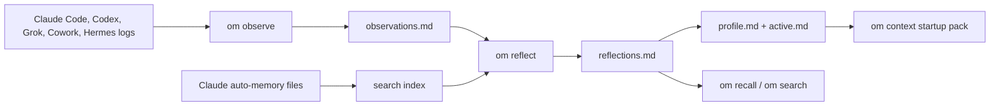

# Observational Memory


[](https://pypi.org/project/observational-memory/)
[](https://pypi.org/project/observational-memory/)
[](https://github.com/intertwine/observational-memory/actions/workflows/ci.yml)
[](https://github.com/intertwine/observational-memory/stargazers)

**Local memory for the agents you already use.**

Observational Memory, or `om`, gives Claude Code, Codex, Grok Build TUI, Claude Cowork, and Hermes one shared memory on your machine. It watches agent transcripts, writes useful notes into local Markdown files, and gives new sessions a compact startup context. You can search that memory later, export reviewed memory bundles for hosted platforms, or opt in to encrypted multi-machine sync with OM Cluster.

The current release is `v0.6.4`. It includes:

- first-class Grok Build TUI hooks and transcript observation
- budgeted startup context through `om context`
- compact startup profile projection for long-running memory corpora
- project-level active context routing so large active files still fit
- first-class recall through `om recall`
- richer reflection metadata and host-memory controls
- OM Cluster relay operations and health checks
- public-safe cluster validation docs
- Windows, macOS, and Linux install paths

## Quick Install

macOS with Homebrew:

```bash
brew install intertwine/tap/observational-memory
om install
om doctor
```

Linux, macOS, or Windows with `uv`:

```bash
uv tool install observational-memory
om install
om doctor
```

Install the optional enterprise auth extras if you use Anthropic through Vertex AI or Bedrock:

```bash
uv tool install "observational-memory[enterprise]"
```

## What It Does

`om` keeps four main memory files under your local data directory:

| File | Purpose |
| --- | --- |
| `observations.md` | Recent notes from sessions and checkpoints. |
| `reflections.md` | Longer-term facts, preferences, decisions, and active work. |
| `profile.md` | Compact stable context for startup. |
| `active.md` | Compact current context for startup. |

Those files are plain Markdown. You can read them, back them up, and search them.

Default paths:

| Platform | Memory directory | Config directory |
| --- | --- | --- |
| macOS / Linux | `~/.local/share/observational-memory/` | `~/.config/observational-memory/` |
| Windows | `%LOCALAPPDATA%\observational-memory\` | `%APPDATA%\observational-memory\` |

## How Memory Flows



## First Week Workflow

1. Install `om`.
2. Run `om install` and answer the provider questions.
3. Run `om doctor`.
4. Start using Claude Code, Codex, or Grok normally.
5. Search memory when you need it:

```bash
om recall --query "current project status"
om search "release checklist"
```

6. Check generated startup context:

```bash
om context --for codex --cwd "$PWD" --task "finish docs"
```

## Guides

Start here:

- [Documentation index](docs/README.md)
- [Install and setup](docs/install.md)
- [Platform integrations](docs/integrations.md)
- [Hermes plugin](docs/hermes-plugin.md)
- [Search, recall, and startup context](docs/search-and-recall.md)
- [Configuration](docs/configuration.md)
- [OM Cluster sync](docs/om-cluster-sync.md)
- [OM Cluster validation checklist](docs/om-cluster-validation.md)
- [Host memory coexistence](docs/coexistence.md)
- [Maintainer guide](docs/MAINTAINERS.md)

## Agent Support

| Host | Current support |
| --- | --- |
| Claude Code | Hooks for startup context and checkpoints. |
| Codex | Hooks-first startup and Stop checkpoints, with an AGENTS fallback. |
| Grok Build TUI | Native hook file with Claude-compatibility awareness, plus `updates.jsonl` observation. |
| Claude Cowork | Local plugin on macOS with hooks and `/recall`. |
| Hermes | External memory-provider plugin through [intertwine/hermes-observational-memory](https://github.com/intertwine/hermes-observational-memory), plus manual session-log ingestion. |
| ChatGPT / Claude Managed Agents | Reviewed export bundles through `om export`; `om` does not silently write hosted memory. |

## Common Commands

```bash
om status
om doctor
om observe --source codex
om reflect
om recall --query "what was decided about sync?"
om recall --handle startup:active
om search "preferences" --json
om export --target chatgpt
om export --target claude-managed-agents --output ./om-claude-memory
```

OM Cluster is off until you initialize or join a cluster:

```bash
om cluster init --name "Personal Memory" --transport filesystem:~/Sync/om-cluster --import-existing
om cluster invite --expires 10m
om cluster join "omc1:..."
om cluster requests
om cluster approve join_...
om cluster sync
om cluster status
```

Do not sync `~/.local/share/observational-memory/` directly with Dropbox, iCloud, Syncthing, rsync, or a NAS. Use the cluster transport directory instead.

## Architecture At A Glance

<p align="center">
  
</p>

The short version:

- `om observe` turns transcripts into recent notes.
- `om reflect` turns recent notes into durable memory.
- `om context` gives agents a bounded startup pack.
- `om recall` and `om search` retrieve more when the startup pack is not enough.
- `om export` prepares reviewed memory seed bundles for hosted systems.
- `om cluster` syncs encrypted records across machines when you opt in.

## Release State

`v0.6.4` is the current release. It is a stability patch that raises the `SessionStart` hook timeout from 5 s to 15 s across Claude Code, Codex, Grok Build TUI, and Cowork to prevent startup timeouts on cold Python launches or larger memory stores. It also ships a permanent regression test (`make verify-session-start`) so this class of issue stays fixed. Grok Build TUI first-class support (introduced in v0.6.3) remains.

Before the next release, maintainers should run:

```bash
make check
uv run ruff check .
uv run ruff format --check .
uv run pytest
```

See [docs/MAINTAINERS.md](docs/MAINTAINERS.md) for the full release workflow.
