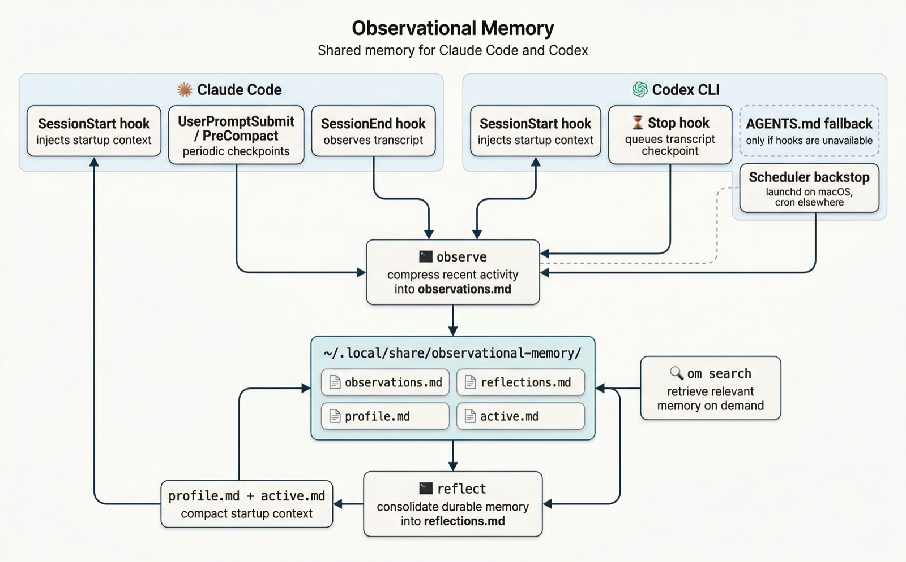

# Observational Memory


[](https://pypi.org/project/observational-memory/)
[](https://pypi.org/project/observational-memory/)
[](https://github.com/intertwine/observational-memory/actions/workflows/ci.yml)
[](https://github.com/intertwine/observational-memory/stargazers)

**Local memory that travels with your agents.**

Observational Memory gives Claude Code, Codex, Claude Cowork, and Hermes a shared memory that survives session boundaries. It captures what your agents learn, distills it into local markdown, restores the right context at startup, and now exports reviewed seed bundles for hosted platform memory.

Version `0.6.0` adds OM Cluster: an opt-in sync layer that moves signed, encrypted memory records across machines through untrusted filesystem, relay, or explicit-peer transports while keeping local Markdown views inspectable. It builds on the `0.5.7` Windows compatibility release, which added Windows-native paths, Claude hooks, and Task Scheduler integration.

```bash
brew install intertwine/tap/observational-memory
om install
om doctor
```

Prefer `uv`?

```bash
uv tool install observational-memory
om install
om doctor
```

What you get:

- **Shared agent context:** Claude Code, Codex, and Cowork hook into the same local memory; Hermes sessions can be ingested from logs.
- **Portable memory exports:** `om export --target chatgpt` and `om export --target claude-managed-agents` generate reviewed, import-ready memory seeds.
- **Inspectable storage:** memory lives as plain markdown under `~/.local/share/observational-memory/`, with local search via `om search`.
- **Forgiving setup:** installer-managed hooks, provider config, scheduler backstops, and diagnostics keep first contact focused on success.

---

## Get Started

### Fast path

```bash
# macOS
brew install intertwine/tap/observational-memory

# Linux / macOS / Windows — with uv
uv tool install observational-memory

om install
om doctor
```

That gives you hooks for Claude Code, hooks-first startup and checkpointing for Codex, local markdown memory in `~/.local/share/observational-memory/` (or `%LOCALAPPDATA%\observational-memory\` on Windows), and built-in search with `om search`. Add `om install --cowork` to install the Cowork plugin (macOS only). Hermes session ingestion is available through `om observe --source hermes` or by pointing `om observe --transcript` at a Hermes session log.

### Windows support

`om` runs on Windows 10/11 with Python 3.11+. Behavior matches macOS/Linux with these substitutions:

| Concern              | macOS / Linux                            | Windows                                                       |
| -------------------- | ---------------------------------------- | ------------------------------------------------------------- |
| Memory dir           | `~/.local/share/observational-memory/`   | `%LOCALAPPDATA%\observational-memory\` (XDG_DATA_HOME wins)   |
| Env file             | `~/.config/observational-memory/env`     | `%APPDATA%\observational-memory\env` (XDG_CONFIG_HOME wins)   |
| Background scheduler | launchd (macOS) / cron (Linux)           | Windows Task Scheduler (`schtasks.exe`)                       |
| Claude hooks         | bash + jq scripts shipped with the wheel | Hooks call `om context` and `om claude-checkpoint` directly   |
| Cowork plugin        | Installed under Application Support      | Not supported (Cowork is macOS-only)                          |

`om install` auto-detects Windows and uses `--scheduler schtasks`; pass `--scheduler none` if you'd rather run observe/reflect manually. The Windows Claude hooks invoke `om` directly, so neither `bash` nor `jq` is required.

### Prerequisites

- Python 3.11+
- [uv](https://docs.astral.sh/uv/) (recommended) or pip
- One LLM access path:
  - Direct API key (`ANTHROPIC_API_KEY` or `OPENAI_API_KEY`)
  - Google Vertex AI auth (ADC) for Anthropic on Vertex
  - AWS credentials/profile/role for Anthropic on Bedrock
- Claude Code and/or Codex CLI installed
- Claude Cowork optional: `om install --cowork` installs the local plugin
- Hermes Agent optional: `om` can ingest session logs from `~/.hermes/sessions/*.jsonl`

### Install options

```bash
# Option A: Install from PyPI
uv tool install observational-memory

# Option A2: Install with enterprise provider dependencies
uv tool install "observational-memory[enterprise]"

# Option B (macOS): Install from Homebrew tap
brew tap intertwine/tap
brew install intertwine/tap/observational-memory

# Set up hooks, fallback instructions, LLM provider config, and the background scheduler
om install

# Optional: install the local Cowork plugin
om install --cowork
```

### Verify

```bash
om --version
om doctor
```

That's it. Your agents now share persistent memory across sessions: plain markdown you can search, inspect, export, and carry into the next platform.
If it saves you repeated onboarding time, a GitHub star helps more people discover it.

### Sync across machines

OM Cluster is an opt-in sync layer for moving memory between machines without syncing the whole OM data directory. It replicates signed, encrypted, append-only records through untrusted transports, then rebuilds local `observations.md`, `reflections.md`, `profile.md`, and `active.md` on each machine.

```bash
# First machine, using a shared-folder transport
om cluster init --name "Personal Memory" --transport filesystem:~/Sync/om-cluster --import-existing
om cluster invite --expires 10m

# Second machine
om cluster join "omc1:..."

# Back on an already trusted machine
om cluster requests
om cluster approve join_...

# Second machine completes approval and syncs
om cluster sync

# Anytime
om cluster status
```

Do **not** point Syncthing, Dropbox, iCloud Drive, rsync, or a NAS at `~/.local/share/observational-memory/`. Use the filesystem transport directory from `om cluster init` instead. Relay and P2P transports use `relay:https://...` and `p2p:http://peer:port[,http://peer2:port]`. OM Cluster never syncs provider env files, private keys, `.cursor.json`, `.search-index`, `.scheduler-logs`, `.qmd-docs`, or plaintext memory.

Cluster key rotation uses per-node wrapped key epochs, and `om cluster reencrypt` can append new-key historical payload rewrap records after a rotation. Old transport blobs and backups are not deleted automatically.

Cluster sync is disabled until `om cluster init` or `om cluster join` creates local config and keys. See [docs/om-cluster-sync.md](docs/om-cluster-sync.md) for setup, operation, security, redaction caveats, and recovery guidance.

### Export to platform-native memory

`om` remains local-first, and its reviewed seed bundles for hosted memory systems remain available:

```bash
# Concise seed to paste/upload into ChatGPT or a ChatGPT project
om export --target chatgpt

# Small focused files ready to seed Claude Managed Agents memory stores
om export --target claude-managed-agents
```

ChatGPT Memory is user-controlled through saved memories, reference chat history, project memory, files, connected apps, and proactive features like Pulse; there is not a general developer write API for saved ChatGPT memories. The ChatGPT export is therefore a concise seed for the user to review and intentionally import.

Claude Managed Agents memory stores are file/document based, can be attached read-only or read-write, and are the substrate that Anthropic's dreaming research preview refines between sessions. The Claude export writes small, focused markdown files plus a manifest so the bundle can be seeded into a memory store without making OM write directly into platform memory.

---

## Why People Install It

If you switch between Claude Code, Codex, Cowork, and Hermes, context gets lost fast. Yesterday's architecture decisions, today's preferences, and the task you were halfway through all disappear into old transcripts, so every new session starts colder than it should.

Observational Memory gives your agents one shared memory in `~/.local/share/observational-memory/`. It keeps fresh work flowing into observations and reflections, regenerates compact startup context, and leaves everything in plain markdown so you can inspect it instead of trusting a black box:

<p align="center">
  
</p>

Claude Code, Codex, and Cowork feed the same local memory, start from compact context, and can search the same accumulated knowledge on demand. Hermes support uses the same observer pipeline through session-log ingestion, so its work can land in the same memory files even though install-time hooks are currently Claude/Codex/Cowork-specific.

### Five tiers of memory

| Tier                    | Updated                                              | Retention    | Size                | Contents                                   |
| ----------------------- | ---------------------------------------------------- | ------------ | ------------------- | ------------------------------------------ |
| **Raw transcripts**     | Real-time                                            | Session only | ~50K tokens/day     | Full conversation                          |
| **Auto-memory**         | Hourly scan (no LLM)                                 | Mirrors source | Per-project       | Claude Code per-project discrete facts     |
| **Observations**        | Per session + periodic checkpoints (~15 min default) | 7 days       | ~2K tokens/day      | Timestamped, prioritized notes             |
| **Reflections**         | Daily                                                | Indefinite   | 200–600 lines total | Durable long-term memory                   |
| **Startup profile/act** | Derived on install + observe/reflect                 | Derived      | small startup slice | Compact default context for session start  |
| **Platform exports**    | Manual via `om export`                               | Generated    | Target-specific     | Reviewed ChatGPT/Claude seed bundles       |

> Adapted from [Mastra's Observational Memory](https://mastra.ai/docs/memory/observational-memory) pattern. See the [OpenClaw version](https://github.com/intertwine/openclaw-observational-memory) for the original.

---

## How it works

### Claude Code integration

**SessionStart hook:** On session start, `om context` injects compact derived startup files (`profile.md` + `active.md`) via `additionalContext`. If those files are missing, it regenerates them from reflections/observations. If `om` is unavailable, the shell fallback still supports the older full-file dump behavior.

**SessionEnd hook:** When a session ends, the observer runs on that transcript and compresses it into observations.

**UserPromptSubmit / PreCompact hooks:** Long sessions also trigger periodic checkpoints. They are throttled by `OM_SESSION_OBSERVER_INTERVAL_SECONDS` (default `900`), so capture stays incremental without running on every prompt.

To disable in-session checkpoints while keeping normal end-of-session capture, set:
`OM_DISABLE_SESSION_OBSERVER_CHECKPOINTS=1` in `~/.config/observational-memory/env`.

All hooks are installed automatically to `~/.claude/settings.json`.

### Claude Code auto-memory integration

**Auto-memory as input source:** Claude Code stores per-project discrete facts (preferences, feedback, decisions) in `~/.claude/projects/*/memory/*.md`. The `om observe --source claude-memory` command scans these files, detects changes via content hashing, and indexes them into the search layer. Unlike transcript-based sources, auto-memory files are already distilled — they bypass the observer LLM entirely.

**Cross-project enrichment:** Auto-memory facts from all projects are supplied to the reflector as supplementary context, so knowledge from one project can surface when working in another.

**Hourly background scan:** The installed scheduler runs the auto-memory scan hourly (launchd on macOS by default, cron elsewhere). This path makes no LLM calls; it just hashes, reindexes, and notices deletions so the reflector can clean up stale facts.

### Codex CLI integration

**Hooks-first startup:** `om install --codex` enables Codex's hooks feature in `~/.codex/config.toml` (`[features].hooks = true`). During Codex's feature-flag rename, it also keeps the legacy `[features].codex_hooks = true` alias enabled for older Codex CLI releases. The installer then adds a global `SessionStart` hook in `~/.codex/hooks.json`. That hook runs `om context`, which injects compact derived startup files (`profile.md` + `active.md`) directly into the Codex session.

**Hooks-first checkpointing:** The installer also adds a global `Stop` hook in `~/.codex/hooks.json`. At turn end, that hook queues a transcript-specific checkpoint for the active Codex transcript, so `om` can observe only the current session instead of rescanning all recent sessions.

**AGENTS fallback:** The installer still maintains `~/.codex/AGENTS.md`, but only as a conditional fallback. If hooks are unavailable or disabled, AGENTS tells Codex to read `profile.md` and `active.md` manually before substantial work. Deeper memory remains available through `om search`, `reflections.md`, and `observations.md`.

**Scheduler backstop:** A background job still runs every 15 minutes by default, scans `~/.codex/sessions/` for new transcript data (`*.json` and `*.jsonl`), and compresses it into observations. On macOS that backstop uses launchd by default; elsewhere it uses cron. This is now the safety net rather than the primary path, which helps when hooks are unavailable or a session exits before `Stop` fires.

Because Codex hooks are still experimental, keeping the AGENTS fallback and scheduler backstop is intentional.

### Claude Cowork integration

**Local plugin:** `om install --cowork` copies a bundled plugin to `~/Library/Application Support/Claude/local-agent-mode-plugins/observational-memory/`. The plugin follows the current Claude plugin layout with `.claude-plugin/plugin.json`, `version.json`, `hooks/hooks.json`, a skill, and a `/recall` command.

**SessionStart hook:** When a Cowork session starts, the plugin runs `om context` and injects compact derived startup files (`profile.md` + `active.md`) as additional context.

**SessionEnd / checkpoint hooks:** Cowork `SessionEnd`, `UserPromptSubmit`, and `PreCompact` hooks run `om observe --source cowork` for the active `audit.jsonl` transcript. In-session checkpoints use the same throttle variables as Claude Code hooks.

**Manual observe path:** You can process Cowork sessions directly:

```bash
om observe --source cowork
om observe --transcript "$HOME/Library/Application Support/Claude/local-agent-mode-sessions/.../audit.jsonl" --source cowork
```

### Hermes Agent integration

**Session-log support:** `om` can parse Hermes session JSONL logs from `~/.hermes/sessions/`. The parser keeps user messages, assistant prose, and compact tool-call summaries while discarding session metadata, raw tool output, and other machine-oriented records that do not help memory extraction.

**Manual observe path:** You can process Hermes work with the same observer pipeline used for Claude/Codex:

```bash
om observe --source hermes
om observe --transcript ~/.hermes/sessions/session-123.jsonl --source hermes
```

**Current scope:** Hermes support is transcript ingestion plus shared-memory compatibility. `om install` does not currently install Hermes hooks or a Hermes-specific scheduler backstop, so Hermes is a manual or integration-driven input path rather than a first-class installer target.

### Reflector

A daily background job runs the reflector at 04:00 local machine time, which:

1. Reads the `Last reflected` timestamp from the existing reflections
2. Filters observations to only those from that date onward (incremental; skips already-processed days)
3. If the filtered observations fit in one LLM call (<30K tokens), processes them in a single pass
4. If they're too large (e.g., after a backfill), automatically chunks by date section and folds each chunk into the reflections incrementally
5. Merges, promotes (🟡→🔴), demotes, and archives entries
6. Stamps `Last updated` and `Last reflected` timestamps programmatically

Reflection entries include inline `<!--om: ...-->` metadata for stable entry IDs, kind, `last_seen`, node, and scope. This lets OM distinguish evergreen preferences from decaying snapshot facts and coexist more cleanly with host-agent memory systems. See [docs/coexistence.md](docs/coexistence.md).
7. Writes the updated `reflections.md`
8. Trims observations older than 7 days

If that daily run is missed, for example because a laptop is asleep, the next successful `om observe` run will automatically catch reflections up to the newest observation date.

### Priority system

| Level | Meaning                | Examples                                    | Retention  |
| ----- | ---------------------- | ------------------------------------------- | ---------- |
| 🔴    | Important / persistent | User facts, decisions, project architecture | Months+    |
| 🟡    | Contextual             | Current tasks, in-progress work             | Days–weeks |
| 🟢    | Minor / transient      | Greetings, routine checks                   | Hours      |

### LLM providers and auth

The observer and reflector call an LLM API for compression.
Provider and auth settings are stored in:

```bash
~/.config/observational-memory/env
```

`om install` creates this file with `0600` permissions (owner-read/write only).
It supports both interactive setup and non-interactive flags.

Supported provider profiles:

| Profile | `OM_LLM_PROVIDER` | Auth mode | Required settings |
| --- | --- | --- | --- |
| Direct Anthropic | `anthropic` | API key | `ANTHROPIC_API_KEY` |
| Direct OpenAI | `openai` | API key | `OPENAI_API_KEY` |
| Anthropic on Vertex | `anthropic-vertex` | Google ADC | `OM_VERTEX_PROJECT_ID`, `OM_VERTEX_REGION` |
| Anthropic on Bedrock | `anthropic-bedrock` | AWS credential chain | `OM_BEDROCK_REGION` (or `AWS_REGION`) |
| Legacy auto-detect | `auto` | API key | prefers `ANTHROPIC_API_KEY`, then `OPENAI_API_KEY` |

The `om` CLI loads this file automatically, including when `om` is invoked by hooks or background scheduler jobs.
You do not need to export keys in your shell profile.

Model selection precedence:

1. `OM_LLM_OBSERVER_MODEL` / `OM_LLM_REFLECTOR_MODEL`
2. `OM_LLM_MODEL`
3. Provider default (`claude-sonnet-4-5-20250929` for Anthropic profiles, `gpt-4o-mini` for OpenAI)

Example direct key setup:

```bash
OM_LLM_PROVIDER=anthropic
ANTHROPIC_API_KEY=sk-ant-...
```

Example Vertex setup:

```bash
OM_LLM_PROVIDER=anthropic-vertex
OM_VERTEX_PROJECT_ID=my-gcp-project
OM_VERTEX_REGION=us-east5
OM_LLM_MODEL=claude-sonnet-4-5-20250929
```

Example Bedrock setup:

```bash
OM_LLM_PROVIDER=anthropic-bedrock
OM_BEDROCK_REGION=us-east-1
OM_LLM_MODEL=anthropic.claude-sonnet-4-5-20250929-v1:0
```

---

## CLI reference

```bash
# Show the installed version
om --version

# Run observer on all recent transcripts
om observe

# Run observer on a specific transcript
om observe --transcript ~/.claude/projects/.../abc123.jsonl
om observe --transcript ~/.codex/sessions/.../session.jsonl --source codex
om observe --transcript "$HOME/Library/Application Support/Claude/local-agent-mode-sessions/.../audit.jsonl" --source cowork
om observe --transcript ~/.hermes/sessions/session-123.jsonl --source hermes

# Run observer for one source only
om observe --source claude
om observe --source codex
om observe --source cowork
om observe --source hermes
om observe --source claude-memory

# Run reflector
om reflect

# Search memories
om search "PostgreSQL setup"
om search "current projects" --limit 5
om search "backfill" --json
om search "launchd" --raw-qmd       # native qmd output / links (QMD backends only)
om search "preferences" --reindex   # rebuild index before searching

# Export platform-native memory seed bundles
om export --target chatgpt
om export --target claude-managed-agents --output ./om-claude-memory
om export --target generic --include-observations

# Backfill all historical transcripts
om backfill --source claude
om backfill --dry-run               # preview what would be processed

# Dry run (print output without writing)
om observe --dry-run
om reflect --dry-run

# Install/uninstall
om install [--claude|--codex|--cowork|--both|--all] [--scheduler auto|launchd|cron|none]
om install --provider anthropic-vertex --vertex-project-id my-proj --vertex-region us-east5 --llm-model claude-sonnet-4-5-20250929 --non-interactive
om install --provider anthropic-bedrock --bedrock-region us-east-1 --llm-model anthropic.claude-sonnet-4-5-20250929-v1:0 --non-interactive
om uninstall [--claude|--codex|--cowork|--both|--all] [--purge]

# Legacy compatibility alias
# --cron/--no-cron maps to --scheduler cron|none

# Check status
om status

# Run diagnostics
om doctor
om doctor --json              # machine-readable output
om doctor --validate-key      # test configured provider access with a live call
```

---

## Configuration

### LLM provider settings

```bash
~/.config/observational-memory/env
```

Created by `om install` with `0600` permissions. Typical values:

```bash
OM_LLM_PROVIDER=anthropic
OM_LLM_MODEL=claude-sonnet-4-5-20250929
ANTHROPIC_API_KEY=sk-ant-...
```

This file is loaded by the `om` CLI at startup, including when `om` is invoked by Claude Code hooks or background scheduler jobs. Environment variables already present in your shell take precedence.

### Memory location

Default: `~/.local/share/observational-memory/`

Key files:

- `profile.md` — compact stable startup profile
- `active.md` — compact active startup context
- `reflections.md` — full long-term memory
- `observations.md` — recent detailed notes

Override with `XDG_DATA_HOME`:

```bash
export XDG_DATA_HOME=~/my-data
# Memory will be at ~/my-data/observational-memory/
```

### Background schedules

The installer sets up these schedules by default:

- macOS: LaunchAgents in `~/Library/LaunchAgents/`
- Other platforms: cron jobs

- **Observer backstop (Codex):** `*/15 * * * *` by default (controlled by `OM_CODEX_OBSERVER_INTERVAL_MINUTES`, e.g. `*/10 * * * *` for 10 min)
- **Auto-memory scan:** `0 * * * *` (hourly, no LLM calls — just hash comparison and reindex)
- **Reflector:** `0 4 * * *` (daily at 04:00 local machine time)

Set `OM_CODEX_OBSERVER_INTERVAL_MINUTES` in `~/.config/observational-memory/env` to tune Codex polling (`1` = every minute). Even with hooks enabled, this background backstop remains installed.

If you explicitly choose cron, adjust it with `crontab -e`. On macOS default installs, OM manages the LaunchAgent plist files for you.

### Search backend

Memory search uses a pluggable backend architecture. Three backends are available:

| Backend      | Default | Requires                                     | Method                                                                         |
| ------------ | ------- | -------------------------------------------- | ------------------------------------------------------------------------------ |
| `bm25`       | Yes     | Nothing (bundled)                            | Token-based keyword matching via `rank-bm25`                                   |
| `qmd`        | No      | [QMD CLI](https://github.com/tobi/qmd)       | BM25 keyword search via QMD's FTS5 engine                                      |
| `qmd-hybrid` | No      | [QMD CLI](https://github.com/tobi/qmd)       | Hybrid BM25 + vector embeddings + optional reranking                           |
| `none`       | No      | Nothing                                      | Disables search entirely                                                       |

The default `bm25` backend works out of the box.
The index is rebuilt automatically after each observe/reflect run and stored at `~/.local/share/observational-memory/.search-index/bm25.pkl`.

To switch backends, set `OM_SEARCH_BACKEND` in your env file:

```bash
# ~/.config/observational-memory/env
OM_SEARCH_BACKEND=qmd-hybrid
OM_QMD_INDEX_NAME=observational-memory
# Optional on QMD >= 2.1.0: faster hybrid search without reranking
# OM_QMD_NO_RERANK=1
# Optional: override QMD's embed / rerank / generate models for OM only
# OM_QMD_EMBED_MODEL=
# OM_QMD_RERANK_MODEL=
# OM_QMD_GENERATE_MODEL=
OM_CODEX_OBSERVER_INTERVAL_MINUTES=10
```

Or export it in your shell:

```bash
export OM_SEARCH_BACKEND=qmd-hybrid
export OM_QMD_INDEX_NAME=observational-memory
export OM_CODEX_OBSERVER_INTERVAL_MINUTES=10
```

#### Using QMD (optional)

[QMD](https://github.com/tobi/qmd) provides hybrid search (BM25 + vector embeddings + reranking) for better recall on semantic queries. Models run locally, so no extra API key is required. `om` benefits most from QMD `>= 2.1.0`. To set it up:

```bash
# 1. Install QMD
npm install -g @tobilu/qmd
# or
bun install -g @tobilu/qmd

# 2. Point om at the QMD backend
export OM_SEARCH_BACKEND=qmd-hybrid
export OM_QMD_INDEX_NAME=observational-memory

# 3. Rebuild the om-managed QMD index
om search --reindex "test query"

# 4. Build embeddings for hybrid/vector search
qmd --index observational-memory embed

# 5. Optional on QMD >= 2.1.0: skip reranking for faster hybrid results
export OM_QMD_NO_RERANK=1

# 6. Verify the install and inspect the collection
om status
om doctor
```

When using QMD, memory documents are written as `.md` files under `~/.local/share/observational-memory/.qmd-docs/`.
They are registered as a QMD collection named `observational-memory` inside the QMD index named by `OM_QMD_INDEX_NAME` (default: `observational-memory`).
`om search` and `om context` use whichever backend is configured.

QMD config:

| Variable | Default | Purpose |
| -------- | ------- | ------- |
| `OM_QMD_INDEX_NAME` | `observational-memory` | Keeps OM's collection isolated inside its own QMD index. |
| `OM_QMD_NO_RERANK` | `0` | On QMD `>= 2.1.0`, skips hybrid reranking for lower-latency queries. |
| `OM_QMD_EMBED_MODEL` | unset | Overrides QMD's embedding model for OM subprocess calls. |
| `OM_QMD_RERANK_MODEL` | unset | Overrides QMD's rerank model for OM subprocess calls. |
| `OM_QMD_GENERATE_MODEL` | unset | Overrides QMD's generation model for OM subprocess calls. |

QMD search output:

- `qmd` uses keyword search only and does not require embeddings.
- `qmd-hybrid` uses BM25 + vector search and works best after `qmd --index observational-memory embed`.
- The first `qmd embed` run downloads QMD's local embedding model, so expect an initial one-time setup cost.
- `OM_QMD_NO_RERANK=1` keeps hybrid recall while skipping the slowest reranking step on QMD `>= 2.1.0`.
- In `om`, `OM_QMD_NO_RERANK=1` also avoids QMD's plain-string expansion path, which keeps fast hybrid lookups from pulling larger generation models on first use.
- `om status` and `om doctor` will show whether QMD is installed, indexed, and embedded.
- `om search --json` includes `source_path`, `source_line`, `qmd_file`, `qmd_docid`, and `qmd_line` when available.
- `om search --raw-qmd` passes through native QMD CLI output and terminal links for advanced users. It only works with `qmd` and `qmd-hybrid`, and it cannot be combined with `--json`.
- Maintainers can benchmark the repo-local QMD fixture with `make qmd-bench` as documented in [`docs/MAINTAINERS.md`](docs/MAINTAINERS.md).

QMD troubleshooting:

- If `om doctor` says QMD is missing, install QMD first and make sure `qmd` is on your `PATH`.
- If `qmd-hybrid` returns only lexical-quality results, rebuild the OM collection and run `qmd --index observational-memory embed`.
- If `OM_QMD_NO_RERANK=1` appears to do nothing, run `om status` or `om doctor`; older QMD installs do not advertise `--no-rerank`.
- If the first plain `qmd-hybrid` query feels slow, QMD may be downloading its local rerank or expansion models; use `OM_QMD_NO_RERANK=1` for lower-latency interactive lookups.
- If `om search --raw-qmd` errors, confirm `OM_SEARCH_BACKEND` is `qmd` or `qmd-hybrid`.
- If maintainer benchmark commands fail at `make qmd-bench-preflight`, your local QMD install is older than the `qmd bench` feature and should be upgraded before release validation.

### Tuning

Edit the prompts in `prompts/` to adjust:

- **What gets captured:** priority definitions in `observer.md`
- **How aggressively things are merged:** rules in `reflector.md`
- **Target size:** the reflector aims for 200 to 600 lines

---

## Example output

### Observations (`observations.md`)

```markdown
# Observations

## 2026-02-10

### Current Context

- **Active task:** Setting up FastAPI project for task manager app
- **Mood/tone:** Focused, decisive
- **Key entities:** Atlas, FastAPI, PostgreSQL, Tortoise ORM
- **Suggested next:** Help with database models

### Observations

- 🔴 14:00 User is building a task management REST API with FastAPI
- 🔴 14:05 User prefers PostgreSQL over SQLite for production (concurrency)
- 🟡 14:10 Changed mind from SQLAlchemy to Tortoise ORM (finds SQLAlchemy too verbose)
- 🔴 14:15 User's name is Alex, backend engineer, prefers concise code examples
```

### Reflections (`reflections.md`)

```markdown
# Reflections — Long-Term Memory

_Last updated: 2026-02-10 04:00 UTC_
_Last reflected: 2026-02-10_

## Core Identity

- **Name:** Alex
- **Role:** Backend engineer
- **Communication style:** Direct, prefers code over explanation
- **Preferences:** FastAPI, PostgreSQL, Tortoise ORM

## Active Projects

### Task Manager (Atlas)

- **Status:** Active
- **Stack:** Python, FastAPI, PostgreSQL, Tortoise ORM
- **Key decisions:** Postgres for concurrency; Tortoise ORM over SQLAlchemy

## Preferences & Opinions

- 🔴 PostgreSQL over SQLite for production
- 🔴 Concise code examples over long explanations
- 🟡 Tortoise ORM over SQLAlchemy (less verbose)
```

---

## Contributing and maintainers

Contributor and maintainer instructions have moved to [`docs/MAINTAINERS.md`](docs/MAINTAINERS.md).

## How it compares to the OpenClaw version

| Feature                | OpenClaw Version        | This Version                                |
| ---------------------- | ----------------------- | ------------------------------------------- |
| **Agents supported**   | OpenClaw only           | Claude Code, Codex CLI, Claude Cowork, and Hermes session logs |
| **Scope**              | Per-workspace           | User-level (shared across all projects)     |
| **Observer trigger**   | OpenClaw cron job       | Claude/Cowork hooks; Codex hooks + scheduler backstop; Hermes manual/log ingestion |
| **Context injection**  | AGENTS.md instructions  | Claude/Cowork SessionStart hooks; Codex SessionStart hook + AGENTS fallback |
| **Memory location**    | `workspace/memory/`     | `~/.local/share/observational-memory/`      |
| **Compression engine** | OpenClaw agent sessions | Direct LLM API calls (Anthropic/OpenAI)     |
| **Cross-agent memory** | No                      | Yes                                         |
| **Platform exports**   | No                      | ChatGPT, Claude Managed Agents, and generic seed bundles |

---

## FAQ

**Q: Does this replace RAG / vector search?**
A: For personal context, mostly yes. Observational memory tracks facts about you (preferences, projects, working style). RAG is still better for large document collections. Use BM25 for lightweight local retrieval, or `qmd-hybrid` with [QMD](https://github.com/tobi/qmd) if you want hybrid semantic search.

**Q: How much does it cost?**
A: The observer processes only new messages per session (~200–1K input tokens typical). The reflector runs once daily. Expect ~$0.05–0.20/day with Sonnet-class models.

**Q: What if I only use Claude Code?**
A: Run `om install --claude`. The Codex integration is entirely optional.

**Q: Can I manually edit the memory files?**
A: Yes. Both `observations.md` and `reflections.md` are plain markdown. The observer appends; the reflector overwrites. Manual edits to reflections will be preserved.

**Q: What happens if the reflector runs on a huge backlog?**
A: The reflector runs incrementally. It reads `Last reflected` from `reflections.md` and only processes newer observations. If that timestamp is missing (first run or after backfill), it chunks observations by date and folds them in batches so the model is not overloaded. Output budget is 8192 tokens, which is enough for the 200 to 600 line target.

**Q: What about privacy?**
A: Everything runs locally. Transcripts are processed by the LLM API you configure (Anthropic or OpenAI), subject to their data policies. No data is sent anywhere else.

---

## Credits

- Inspired by [Mastra's Observational Memory](https://mastra.ai/docs/memory/observational-memory)
- Original [OpenClaw version](https://github.com/intertwine/openclaw-observational-memory)
- License: MIT
