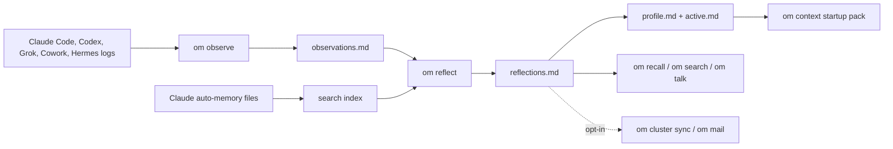

# Observational Memory


[](https://pypi.org/project/observational-memory/)
[](https://pypi.org/project/observational-memory/)
[](https://github.com/intertwine/observational-memory/actions/workflows/ci.yml)
[](https://github.com/intertwine/observational-memory/stargazers)

**Local memory for the agents you already use.**

Observational Memory, or `om`, gives Claude Code, Codex, Grok Build TUI, Claude Cowork, and Hermes one shared memory on your machine. It watches agent transcripts, distills them into local Markdown files, and hands every new session a compact startup context — so your agents stop starting cold.

Why people use it:

- **No more cold starts.** Every new session begins knowing who you are, how you work, and what you were doing.
- **One memory across agents.** What Claude learns today, Codex knows tomorrow. Switch tools without losing context.
- **Your memory is yours.** Plain Markdown files on your machine — readable, searchable, backed up, never silently uploaded.
- **Costs you can see.** Every LLM call is tracked locally, with token and dollar budgets that stop a runaway job.

## New in v0.8.0

v0.7.0 made reflection scale. v0.8.0 makes memory **trustworthy** — durable, provable, and conversational:

- **`om backup` / `om restore`** — host-local snapshots of your memory, with an automatic safety snapshot before every reflection.
- **`om talk`** — a spoken-style conversation with your own memories; each turn grounds the reply in live recall.
- **Provenance you can audit** — sections carry rot-proof stamps of when and from what they were derived; every fact can say where it came from.
- **Scope governance that fails closed** — `scope=local` memory never leaves your machine by any share-out path: cluster, cloud search, or mail.
- **`om reflect --check-conflicts`** — surfaces high-stakes facts a reflection cycle silently changed, before you trust them.
- **Memory growth instrumentation** — `om doctor` reports how big each memory section is and how cold, so future pruning is grounded in data.
- **OM Mail (experimental preview)** — agents get email inboxes and exchange signed, encrypted memory: notes, context packs, and recall requests, across machines, harnesses, models, and vendors. [Read how it works](docs/mail-memory.md).

Everything is additive; defaults are unchanged, and OM Mail is CLI-only and off until you set it up. Full details in the [v0.8.0 release notes](docs/RELEASE-0.8.0.md).

## Quick Install

macOS with Homebrew:

```bash
brew install intertwine/tap/observational-memory
om install
om doctor
```

Linux, macOS, or Windows with `uv`:

```bash
uv tool install observational-memory
om install
om doctor
```

`om install` connects your agents and asks which LLM provider to use — a metered API key, or your existing ChatGPT or SuperGrok subscription via `om login`. Anthropic through Vertex AI or Bedrock needs the enterprise extras: `uv tool install "observational-memory[enterprise]"`.

## What It Does

`om` keeps four main memory files under your local data directory:

| File | Purpose |
| --- | --- |
| `observations.md` | Recent notes from sessions and checkpoints. |
| `reflections.md` | Longer-term facts, preferences, decisions, and active work. |
| `profile.md` | Compact stable context for startup. |
| `active.md` | Compact current context for startup. |

Those files are plain Markdown. You can read them, back them up, and search them.

Default paths:

| Platform | Memory directory | Config directory |
| --- | --- | --- |
| macOS / Linux | `~/.local/share/observational-memory/` | `~/.config/observational-memory/` |
| Windows | `%LOCALAPPDATA%\observational-memory\` | `%APPDATA%\observational-memory\` |

## How Memory Flows



## First Week Workflow

1. Install `om`.
2. Run `om install` and answer the provider questions.
3. Run `om doctor`.
4. Start using Claude Code, Codex, or Grok normally — memory accumulates on its own.
5. Search memory when you need it:

```bash
om recall --query "current project status"
om search "release checklist"
```

6. Talk to your memory, or check what new sessions will see:

```bash
om talk --query "what was I working on last week?"
om context --for codex --cwd "$PWD" --task "finish docs"
```

## Common Commands

```bash
om status
om doctor                       # health check, now with memory-growth report
om observe --source codex
om reflect
om reflect --check-conflicts    # flag silently-changed high-stakes facts
om reflect --async              # offline OpenAI Batch job at ~50% token cost
om jobs poll                    # apply completed async jobs
om backup --reason pre-experiment
om restore --list
om recall --query "what was decided about sync?"
om talk
om search "preferences" --json
om usage status                 # token usage, cost, and budgets
om usage budget set --daily-usd 5.00
om context --quality-report     # startup-context dedup / freshness / budget report
om export --target chatgpt
```

Multi-machine and agent-to-agent memory are opt-in:

```bash
# OM Cluster: encrypted full sync across YOUR machines
om cluster init --name "Personal Memory" --transport filesystem:~/Sync/om-cluster --import-existing
om cluster sync

# OM Mail (experimental): selective memory exchange between DISTINCT agents
om mail init --username my-agent
om mail send-note peer@agentmail.to --text "decision: ship v0.8.0"
om mail sync
```

Do not sync `~/.local/share/observational-memory/` directly with Dropbox, iCloud, Syncthing, rsync, or a NAS. Use the cluster transport directory instead.

## Agent Support

| Host | Current support |
| --- | --- |
| Claude Code | Hooks for startup context and checkpoints. |
| Codex | Hooks-first startup and Stop checkpoints, with an AGENTS fallback. |
| Grok Build TUI | Native hook file with Claude-compatibility awareness, plus `updates.jsonl` observation. |
| Claude Cowork | Local plugin on macOS with hooks and `/recall`. |
| Hermes | External memory-provider plugin through [intertwine/hermes-observational-memory](https://github.com/intertwine/hermes-observational-memory), plus manual session-log ingestion. |
| ChatGPT / Claude Managed Agents | Reviewed export bundles through `om export`; `om` does not silently write hosted memory. |

Out-of-tree integrations have first-class seams: mail providers and CLI add-ons plug in through public entry points ([CONTRIBUTING.md](CONTRIBUTING.md)).

## Guides

Start here:

- [Documentation index](docs/README.md)
- [Install and setup](docs/install.md)
- [Platform integrations](docs/integrations.md)
- [Hermes plugin](docs/hermes-plugin.md)
- [Search, recall, and startup context](docs/search-and-recall.md)
- [Talk to your memories (`om talk`)](docs/talk-to-memories.md)
- [Configuration](docs/configuration.md)
- [OM Cluster sync](docs/om-cluster-sync.md)
- [OM Mail: email inboxes as a memory substrate (experimental)](docs/mail-memory.md)
- [OM Cluster validation checklist](docs/om-cluster-validation.md)
- [Host memory coexistence](docs/coexistence.md)
- [Maintainer guide](docs/MAINTAINERS.md)

## Architecture At A Glance

<p align="center">
  
</p>

The short version:

- `om observe` turns transcripts into recent notes.
- `om reflect` turns recent notes into durable memory — with provenance, scope rules, and a pre-reflect safety snapshot.
- `om context` gives agents a bounded startup pack.
- `om recall`, `om search`, and `om talk` retrieve more when the startup pack is not enough.
- `om export` prepares reviewed memory seed bundles for hosted systems.
- `om cluster` syncs encrypted records across machines when you opt in.
- `om mail` (experimental) exchanges signed, encrypted memory between distinct agents over email.

## Release State

`v0.8.0` is the current release. Its theme is **trustworthy memory**: durable (`om backup`/`om restore` with automatic pre-reflect snapshots), provable (section provenance stamps, fail-closed `scope=local` governance across every share-out path, `om reflect --check-conflicts`), and conversational (`om talk`) — plus the experimental OM Mail preview ([docs/mail-memory.md](docs/mail-memory.md)) and growth instrumentation in `om doctor`. It builds on v0.7.0's section-targeted reflection at scale and the v0.6.x usage/budget and async-Batch subsystems. Full notes: [docs/RELEASE-0.8.0.md](docs/RELEASE-0.8.0.md).

Upgrading from any 0.6.x/0.7.x: everything is additive and defaults are unchanged — install the new version and run `om doctor`. New surfaces (`om backup`, `om talk`, `om mail`, `--check-conflicts`) activate only when you call them.

Before the next release, maintainers should run:

```bash
make check
uv run ruff check .
uv run ruff format --check .
uv run pytest
```

See [docs/MAINTAINERS.md](docs/MAINTAINERS.md) for the full release workflow.

## Contributing

The `om` core is MIT licensed and stays that way. Pull requests are welcome —
see [CONTRIBUTING.md](CONTRIBUTING.md) for development setup and contributor
terms (DCO sign-off plus a relicensing grant to Intertwine AI, the project
steward, which also builds separately licensed team add-ons on the core's
public plugin interfaces).
