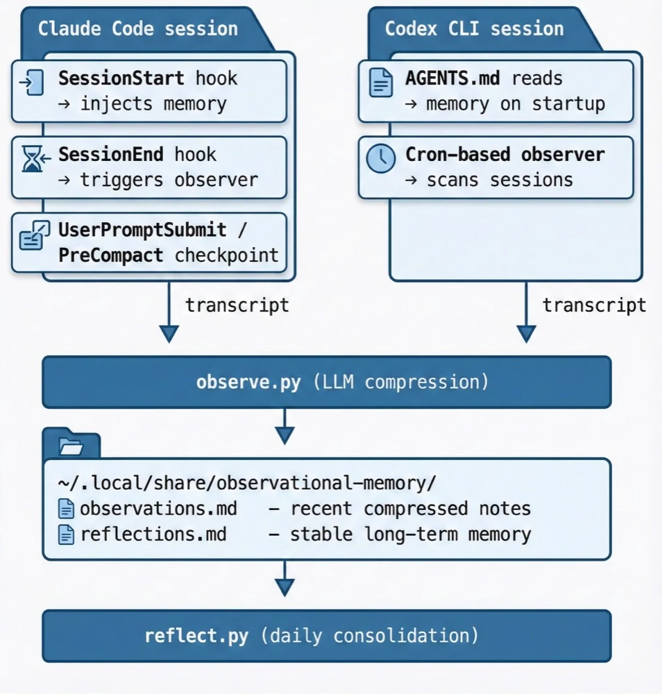

# Observational Memory

[](https://pypi.org/project/observational-memory/)
[](https://github.com/intertwine/observational-memory/actions/workflows/ci.yml)

**Cross-agent shared memory for Claude Code and Codex CLI, with built-in search and no database setup.**

Observational Memory runs two background jobs (Observer and Reflector) that condense transcript history into shared markdown memory. On session start, it retrieves relevant context with a pluggable search layer: built-in BM25 by default, plus optional QMD and qmd-hybrid backends for stronger semantic recall.

> Adapted from [Mastra's Observational Memory](https://mastra.ai/docs/memory/observational-memory) pattern. See the [OpenClaw version](https://github.com/intertwine/openclaw-observational-memory) for the original.

---

## Quick start

### Prerequisites

- Python 3.11+
- [uv](https://docs.astral.sh/uv/) (recommended) or pip
- One LLM access path:
  - Direct API key (`ANTHROPIC_API_KEY` or `OPENAI_API_KEY`)
  - Google Vertex AI auth (ADC) for Anthropic on Vertex
  - AWS credentials/profile/role for Anthropic on Bedrock
- Claude Code and/or Codex CLI installed

### Install

```bash
# Option A: Install from PyPI
uv tool install observational-memory

# Option A2: Install with enterprise provider dependencies
uv tool install "observational-memory[enterprise]"

# Option B (macOS): Install from Homebrew tap
brew tap intertwine/tap
brew install intertwine/tap/observational-memory

# Set up hooks, LLM provider config, and cron
om install
```

### Verify

```bash
om doctor
```

That's it. Your agents now share persistent, compressed memory.

---

## Why

If you use Claude Code in one terminal and Codex CLI in another, context gets lost fast. Each session starts cold.

Observational Memory fixes this. A single set of compressed memory files lives at `~/.local/share/observational-memory/` and is shared across all your agents:

<p align="center">
  
</p>

### Three tiers of memory

| Tier                | Updated                                              | Retention    | Size                | Contents                        |
| ------------------- | ---------------------------------------------------- | ------------ | ------------------- | ------------------------------- |
| **Raw transcripts** | Real-time                                            | Session only | ~50K tokens/day     | Full conversation               |
| **Observations**    | Per session + periodic checkpoints (~15 min default) | 7 days       | ~2K tokens/day      | Timestamped, prioritized notes  |
| **Reflections**     | Daily                                                | Indefinite   | 200–600 lines total | Identity, projects, preferences |

---

## How it works

### Claude Code integration

**SessionStart hook:** On session start, `om context` retrieves relevant observations (BM25/QMD backend) and injects them with full reflections via `additionalContext`. If search is unavailable, it falls back to the full file dump.

**SessionEnd hook:** When a session ends, the observer runs on that transcript and compresses it into observations.

**UserPromptSubmit / PreCompact hooks:** Long sessions also trigger periodic checkpoints. They are throttled by `OM_SESSION_OBSERVER_INTERVAL_SECONDS` (default `900`), so capture stays incremental without running on every prompt.

To disable in-session checkpoints while keeping normal end-of-session capture, set:
`OM_DISABLE_SESSION_OBSERVER_CHECKPOINTS=1` in `~/.config/observational-memory/env`.

All hooks are installed automatically to `~/.claude/settings.json`.

### Codex CLI integration

**AGENTS.md:** The installer adds instructions to `~/.codex/AGENTS.md` so Codex reads memory files at session start.

**Cron observer:** A cron job runs every 15 minutes, scans `~/.codex/sessions/` for new transcript data (`*.json` and `*.jsonl`), and compresses it into observations.

### Reflector (both)

A daily cron job (04:00 UTC) runs the reflector, which:

1. Reads the `Last reflected` timestamp from the existing reflections
2. Filters observations to only those from that date onward (incremental; skips already-processed days)
3. If the filtered observations fit in one LLM call (<30K tokens), processes them in a single pass
4. If they're too large (e.g., after a backfill), automatically chunks by date section and folds each chunk into the reflections incrementally
5. Merges, promotes (🟡→🔴), demotes, and archives entries
6. Stamps `Last updated` and `Last reflected` timestamps programmatically
7. Writes the updated `reflections.md`
8. Trims observations older than 7 days

### Priority system

| Level | Meaning                | Examples                                    | Retention  |
| ----- | ---------------------- | ------------------------------------------- | ---------- |
| 🔴    | Important / persistent | User facts, decisions, project architecture | Months+    |
| 🟡    | Contextual             | Current tasks, in-progress work             | Days–weeks |
| 🟢    | Minor / transient      | Greetings, routine checks                   | Hours      |

### LLM providers and auth

The observer and reflector call an LLM API for compression.
Provider and auth settings are stored in:

```bash
~/.config/observational-memory/env
```

`om install` creates this file with `0600` permissions (owner-read/write only).
It supports both interactive setup and non-interactive flags.

Supported provider profiles:

| Profile | `OM_LLM_PROVIDER` | Auth mode | Required settings |
| --- | --- | --- | --- |
| Direct Anthropic | `anthropic` | API key | `ANTHROPIC_API_KEY` |
| Direct OpenAI | `openai` | API key | `OPENAI_API_KEY` |
| Anthropic on Vertex | `anthropic-vertex` | Google ADC | `OM_VERTEX_PROJECT_ID`, `OM_VERTEX_REGION` |
| Anthropic on Bedrock | `anthropic-bedrock` | AWS credential chain | `OM_BEDROCK_REGION` (or `AWS_REGION`) |
| Legacy auto-detect | `auto` | API key | prefers `ANTHROPIC_API_KEY`, then `OPENAI_API_KEY` |

The CLI, hooks, and cron jobs source this file automatically.
You do not need to export keys in your shell profile.

Model selection precedence:

1. `OM_LLM_OBSERVER_MODEL` / `OM_LLM_REFLECTOR_MODEL`
2. `OM_LLM_MODEL`
3. Provider default (`claude-sonnet-4-5-20250929` for Anthropic profiles, `gpt-4o-mini` for OpenAI)

Example direct key setup:

```bash
OM_LLM_PROVIDER=anthropic
ANTHROPIC_API_KEY=sk-ant-...
```

Example Vertex setup:

```bash
OM_LLM_PROVIDER=anthropic-vertex
OM_VERTEX_PROJECT_ID=my-gcp-project
OM_VERTEX_REGION=us-east5
OM_LLM_MODEL=claude-sonnet-4-5-20250929
```

Example Bedrock setup:

```bash
OM_LLM_PROVIDER=anthropic-bedrock
OM_BEDROCK_REGION=us-east-1
OM_LLM_MODEL=anthropic.claude-sonnet-4-5-20250929-v1:0
```

---

## CLI reference

```bash
# Run observer on all recent transcripts
om observe

# Run observer on a specific transcript
om observe --transcript ~/.claude/projects/.../abc123.jsonl

# Run observer for one agent only
om observe --source claude
om observe --source codex

# Run reflector
om reflect

# Search memories
om search "PostgreSQL setup"
om search "current projects" --limit 5
om search "backfill" --json
om search "preferences" --reindex   # rebuild index before searching

# Backfill all historical transcripts
om backfill --source claude
om backfill --dry-run               # preview what would be processed

# Dry run (print output without writing)
om observe --dry-run
om reflect --dry-run

# Install/uninstall
om install [--claude|--codex|--both] [--no-cron]
om install --provider anthropic-vertex --vertex-project-id my-proj --vertex-region us-east5 --llm-model claude-sonnet-4-5-20250929 --non-interactive
om install --provider anthropic-bedrock --bedrock-region us-east-1 --llm-model anthropic.claude-sonnet-4-5-20250929-v1:0 --non-interactive
om uninstall [--claude|--codex|--both] [--purge]

# Check status
om status

# Run diagnostics
om doctor
om doctor --json              # machine-readable output
om doctor --validate-key      # test configured provider access with a live call
```

---

## Configuration

### LLM provider settings

```bash
~/.config/observational-memory/env
```

Created by `om install` with `0600` permissions. Typical values:

```bash
OM_LLM_PROVIDER=anthropic
OM_LLM_MODEL=claude-sonnet-4-5-20250929
ANTHROPIC_API_KEY=sk-ant-...
```

This file is sourced by the `om` CLI, the Claude Code hooks, and the cron jobs. Environment variables already present in your shell take precedence.

### Memory location

Default: `~/.local/share/observational-memory/`

Override with `XDG_DATA_HOME`:

```bash
export XDG_DATA_HOME=~/my-data
# Memory will be at ~/my-data/observational-memory/
```

### Cron schedules

The installer sets up:

- **Observer (Codex):** `*/15 * * * *` by default (controlled by `OM_CODEX_OBSERVER_INTERVAL_MINUTES`, e.g. `*/10 * * * *` for 10 min)
- **Reflector:** `0 4 * * *` (daily at 04:00 UTC)

Set `OM_CODEX_OBSERVER_INTERVAL_MINUTES` in `~/.config/observational-memory/env` to tune Codex polling (`1` = every minute).

Edit with `crontab -e` to adjust.

### Search backend

Memory search uses a pluggable backend architecture. Three backends are available:

| Backend      | Default | Requires                                     | Method                                                                         |
| ------------ | ------- | -------------------------------------------- | ------------------------------------------------------------------------------ |
| `bm25`       | Yes     | Nothing (bundled)                            | Token-based keyword matching via `rank-bm25`                                   |
| `qmd`        | No      | [QMD CLI](https://github.com/tobi/qmd) + bun | BM25 keyword search via QMD's FTS5 engine                                      |
| `qmd-hybrid` | No      | [QMD CLI](https://github.com/tobi/qmd) + bun | Hybrid BM25 + vector embeddings + LLM reranking (~2GB models, auto-downloaded) |
| `none`       | No      | Nothing                                      | Disables search entirely                                                       |

The default `bm25` backend works out of the box.
The index is rebuilt automatically after each observe/reflect run and stored at `~/.local/share/observational-memory/.search-index/bm25.pkl`.

To switch backends, set `OM_SEARCH_BACKEND` in your env file:

```bash
# ~/.config/observational-memory/env
OM_SEARCH_BACKEND=qmd-hybrid
OM_CODEX_OBSERVER_INTERVAL_MINUTES=10
```

Or export it in your shell:

```bash
export OM_SEARCH_BACKEND=qmd-hybrid
export OM_CODEX_OBSERVER_INTERVAL_MINUTES=10
```

#### Using QMD (optional)

[QMD](https://github.com/tobi/qmd) provides hybrid search (BM25 + vector embeddings + LLM reranking) for better recall on semantic queries. Models run locally through node-llama-cpp, so no extra API key is required. To set it up:

```bash
# 1. Install bun (QMD runtime)
curl -fsSL https://bun.sh/install | bash

# 2. Install QMD (from GitHub — the npm package is a placeholder)
bun install -g github:tobi/qmd

# 3. Switch the backend in config.py
#    search_backend: str = "qmd-hybrid"

# 4. Rebuild the index
om search --reindex "test query"
```

When using QMD, memory documents are written as `.md` files under `~/.local/share/observational-memory/.qmd-docs/`.
They are registered as a QMD collection named `observational-memory`.
`om search` and `om context` use whichever backend is configured.

### Tuning

Edit the prompts in `prompts/` to adjust:

- **What gets captured:** priority definitions in `observer.md`
- **How aggressively things are merged:** rules in `reflector.md`
- **Target size:** the reflector aims for 200 to 600 lines

---

## Example output

### Observations (`observations.md`)

```markdown
# Observations

## 2026-02-10

### Current Context

- **Active task:** Setting up FastAPI project for task manager app
- **Mood/tone:** Focused, decisive
- **Key entities:** Atlas, FastAPI, PostgreSQL, Tortoise ORM
- **Suggested next:** Help with database models

### Observations

- 🔴 14:00 User is building a task management REST API with FastAPI
- 🔴 14:05 User prefers PostgreSQL over SQLite for production (concurrency)
- 🟡 14:10 Changed mind from SQLAlchemy to Tortoise ORM (finds SQLAlchemy too verbose)
- 🔴 14:15 User's name is Alex, backend engineer, prefers concise code examples
```

### Reflections (`reflections.md`)

```markdown
# Reflections — Long-Term Memory

_Last updated: 2026-02-10 04:00 UTC_
_Last reflected: 2026-02-10_

## Core Identity

- **Name:** Alex
- **Role:** Backend engineer
- **Communication style:** Direct, prefers code over explanation
- **Preferences:** FastAPI, PostgreSQL, Tortoise ORM

## Active Projects

### Task Manager (Atlas)

- **Status:** Active
- **Stack:** Python, FastAPI, PostgreSQL, Tortoise ORM
- **Key decisions:** Postgres for concurrency; Tortoise ORM over SQLAlchemy

## Preferences & Opinions

- 🔴 PostgreSQL over SQLite for production
- 🔴 Concise code examples over long explanations
- 🟡 Tortoise ORM over SQLAlchemy (less verbose)
```

---

## Contributing and maintainers

Contributor and maintainer instructions have moved to [`docs/MAINTAINERS.md`](docs/MAINTAINERS.md).

## How it compares to the OpenClaw version

| Feature                | OpenClaw Version        | This Version                                |
| ---------------------- | ----------------------- | ------------------------------------------- |
| **Agents supported**   | OpenClaw only           | Claude Code + Codex CLI                     |
| **Scope**              | Per-workspace           | User-level (shared across all projects)     |
| **Observer trigger**   | OpenClaw cron job       | Claude: SessionEnd hook; Codex: system cron |
| **Context injection**  | AGENTS.md instructions  | Claude: SessionStart hook; Codex: AGENTS.md |
| **Memory location**    | `workspace/memory/`     | `~/.local/share/observational-memory/`      |
| **Compression engine** | OpenClaw agent sessions | Direct LLM API calls (Anthropic/OpenAI)     |
| **Cross-agent memory** | No                      | Yes                                         |

---

## FAQ

**Q: Does this replace RAG / vector search?**
A: For personal context, mostly yes. Observational memory tracks facts about you (preferences, projects, working style). RAG is still better for large document collections. Use BM25 for lightweight local retrieval, or `qmd-hybrid` with [QMD](https://github.com/tobi/qmd) if you want hybrid semantic search.

**Q: How much does it cost?**
A: The observer processes only new messages per session (~200–1K input tokens typical). The reflector runs once daily. Expect ~$0.05–0.20/day with Sonnet-class models.

**Q: What if I only use Claude Code?**
A: Run `om install --claude`. The Codex integration is entirely optional.

**Q: Can I manually edit the memory files?**
A: Yes. Both `observations.md` and `reflections.md` are plain markdown. The observer appends; the reflector overwrites. Manual edits to reflections will be preserved.

**Q: What happens if the reflector runs on a huge backlog?**
A: The reflector runs incrementally. It reads `Last reflected` from `reflections.md` and only processes newer observations. If that timestamp is missing (first run or after backfill), it chunks observations by date and folds them in batches so the model is not overloaded. Output budget is 8192 tokens, which is enough for the 200 to 600 line target.

**Q: What about privacy?**
A: Everything runs locally. Transcripts are processed by the LLM API you configure (Anthropic or OpenAI), subject to their data policies. No data is sent anywhere else.

---

## Credits

- Inspired by [Mastra's Observational Memory](https://mastra.ai/docs/memory/observational-memory)
- Original [OpenClaw version](https://github.com/intertwine/openclaw-observational-memory)
- License: MIT
