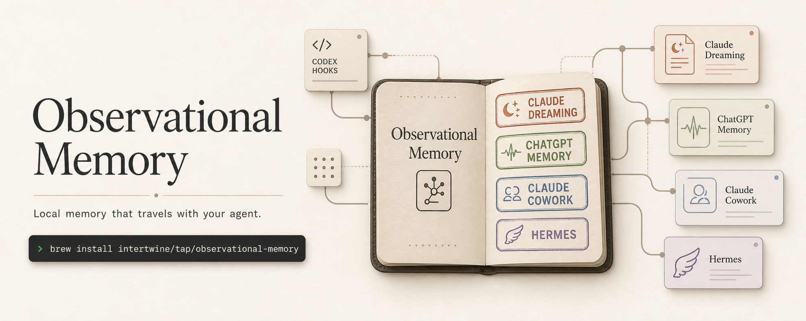
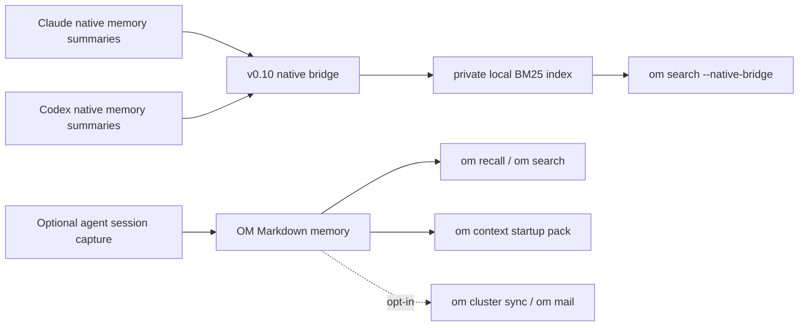
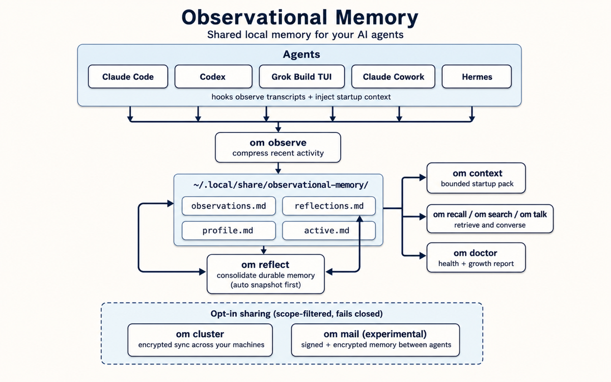

# Observational Memory



[](https://pypi.org/project/observational-memory/)
[](https://github.com/intertwine/observational-memory/releases/latest)
[](https://pypi.org/project/observational-memory/)
[](https://pypi.org/project/observational-memory/)
[](https://github.com/intertwine/observational-memory/actions/workflows/ci.yml)
[](https://github.com/intertwine/observational-memory/stargazers)

**Shared, local memory for AI coding agents — now with a native Claude Code and Codex bridge that needs no transcript capture or an LLM.**

Observational Memory, or `om`, helps agents carry useful context from one session and tool to the next. In v0.10.0, its native-memory bridge reads the small memory summaries that Claude Code and Codex already maintain, indexes an approved set in a private local keyword-search index (BM25), and makes that shared context available through OM retrieval.

The bridge is available on macOS in v0.10.0. It reads native memory sources without changing them. It does **not** ingest raw transcripts, call an LLM, run reflection, or silently upload memory.

## Shortest Path: Native Claude and Codex Memory

For a new Homebrew install, run `brew install intertwine/tap/observational-memory`. If OM is already installed, run `brew upgrade observational-memory`.

Choose the native sources and enable the bridge:

```bash
om native-bridge sources
om install --native-bridge --claude-project "<exact-directory-name-from-the-list>"
```

If Claude Code or Codex was running during installation, save the current work, exit the affected app or CLI session, and start a new session. A running process can retain its previous OM write hooks until it restarts.

Build the first index and check the result:

```bash
om bridge-native-memory
om search --native-bridge "what were we doing in this project?"
om native-bridge status
om doctor
```

The first install needs macOS and at least one eligible Claude project memory directory. Repeat `--claude-project` to include more than one. Codex memory joins the index when either fixed Codex memory file is present. Later installs and one-shot runs reuse the saved private Claude selection when you omit the flag.

Setup is ready when status shows `Config: configured`, `LaunchAgent: enabled and loaded`, and `Generation: ready`, and `om doctor` reports that the older Claude and Codex writers are inactive. If it does not, use the troubleshooting guide before relying on shared recall.

Bridge search is explicit. Ordinary `om search` and `om recall` keep using the full OM memory store and do not merge bridge results.

The bridge refreshes every 15 minutes and skips runs when the Mac is under pressure. Enabling it keeps OM's older Claude, Codex, and Cowork transcript writers off while preserving read-only startup context. It does not change Grok, Kimi, or OpenCode.

See [Native Claude and Codex memory](docs/native-memory-bridge.md) for upgrade, disable, rollback, source scope, and troubleshooting steps.

## New in v0.10.0

- **A native-first bridge.** Share Claude Code and Codex memory summaries without turning on transcript observation or reflection.
- **A private local index.** The bridge accepts only its fixed source allowlist and writes to an isolated BM25 store on your machine.
- **Bounded background refresh.** The macOS service runs every 15 minutes and skips work when the machine does not pass its resource checks.
- **Visible lifecycle state.** `om status` shows bridge configuration, service state, and verified-index readiness. `om doctor` also verifies that the older writer services and hooks remain off.

Full details: [v0.10.0 release notes](docs/RELEASE-0.10.0.md).

## Full OM Install

The native bridge and the full transcript-based workflow are separate operating modes. If you want OM to build its own Markdown observations and reflections instead of using the bridge, use the full installer.

macOS with Homebrew:

```bash
brew install intertwine/tap/observational-memory
om install
om doctor
```

Linux, macOS, or Windows with `uv`:

```bash
uv tool install observational-memory
om install
om doctor
```

`om install` sets up Claude Code and Codex by default and asks which LLM provider to use. `--all` also adds OpenCode, Kimi, Grok, and Cowork. If you use Anthropic through Vertex AI or Bedrock, install with `uv tool install "observational-memory[enterprise]"` instead of Homebrew, then run `om install`.

If the bridge is already enabled, switch modes explicitly:

```bash
om uninstall --native-bridge
om install --both
```

If bridge activation removed a Cowork writer you still want, also run `om install --cowork`. `--both` covers Claude Code and Codex only.

Save current work in Claude Code or Codex, exit the affected app or CLI session, and start a new session so it loads the restored hooks. Then check the result:

```bash
om doctor
```

## How Memory Flows


```mermaid
flowchart LR
    A["Claude native memory summaries"] --> B["v0.10 native bridge"]
    C["Codex native memory summaries"] --> B
    B --> D["private local BM25 index"]
    D --> E["om search --native-bridge"]
    F["Optional agent session capture"] --> G["OM Markdown memory"]
    G --> H["om recall / om search"]
    G --> I["om context startup pack"]
    G -. opt-in .-> J["om cluster sync / om mail"]
```

## First Week Workflow

1. Install `om` on macOS.
2. Run `om native-bridge sources`, then install with an exact Claude project name from that list.
3. If Claude Code or Codex was running during installation, save the current work, exit that app or CLI session, and start a new session. Then run `om doctor`.
4. Use Claude Code and Codex normally. Their native memory summaries remain the source of truth; the bridge refreshes its private index when they change.
5. Retrieve bridge memory when you need it:

```bash
om search --native-bridge "current project status"
```

6. Run `om doctor` to verify the bridge and confirm that older OM writer services and hooks remain off.
7. If you switch to the full OM workflow later, you can talk to OM's Markdown memory (experimental — flags may change) or inspect the startup pack:

```bash
om talk --query "what was I working on last week?"
om context --for codex --cwd "$PWD" --task "finish docs"
```

## Where Your Memory Lives

The full OM workflow keeps four plain-Markdown files you can read, search, and back up:

| File | Purpose |
| --- | --- |
| `observations.md` | Recent notes from sessions and checkpoints. |
| `reflections.md` | Longer-term facts, preferences, decisions, and active work. |
| `profile.md` | Compact stable context for startup. |
| `active.md` | Compact current context for startup. |

| Platform | Memory directory | Config directory |
| --- | --- | --- |
| macOS / Linux | `~/.local/share/observational-memory/` | `~/.config/observational-memory/` |
| Windows | `%LOCALAPPDATA%\observational-memory\` | `%APPDATA%\observational-memory\` |

On macOS, bridge-only state is private and separate by default:

| Bridge state | Default location |
| --- | --- |
| Source selection | `~/.config/observational-memory/native-bridge/config.json` |
| Derived index and receipts | `~/.local/share/observational-memory/.native-memory-bridge/` |
| Scheduled service | `~/Library/LaunchAgents/com.intertwine.observational-memory.native-bridge.plist` |

## Common Commands

### Native Bridge

```bash
om native-bridge sources        # list eligible projects without memory text
om install --native-bridge --claude-project "<exact-directory-name>"
om bridge-native-memory         # run one bounded refresh now
om search --native-bridge "release checklist"
om native-bridge disable        # pause scheduled refresh
om uninstall --native-bridge    # remove bridge service; keep sources/data
om native-bridge status         # focused bridge state; add --json if needed
om status
om doctor                       # also verifies older writers remain off
```

### Full OM Workflow

These commands require the full installer and do not belong to the provider-free bridge mode:

```bash
om observe --source codex
om reflect
om reflect --check-conflicts    # reflect + flag silently-changed high-stakes facts
om reflect --async              # offline OpenAI Batch job at ~50% of the synchronous price
om jobs poll                    # apply completed async jobs
om backup --reason pre-experiment
om restore --list
om recall --query "what was decided about sync?"
om talk
om search "preferences" --json
om usage status                 # token usage, cost, and budgets
om usage budget set --daily-usd 5.00
om context --quality-report     # startup-context dedup / freshness / budget report
om export --target chatgpt
```

Multi-machine and agent-to-agent memory are opt-in:

```bash
# OM Cluster: encrypted full sync across YOUR machines
om cluster init --name "Personal Memory" --transport filesystem:~/Sync/om-cluster --import-existing
om cluster sync

# OM Mail (experimental): selective memory exchange between DISTINCT agents.
# Peers must exchange and pin keys first — see docs/mail-memory.md.
om mail init --username my-agent
om mail peers add peer@agentmail.to --key <PEER_PUBLIC_KEY> --shared-key <SHARED_KEY>
om mail send-note peer@agentmail.to --text "decision: ship the release"
om mail sync
```

Do not sync `~/.local/share/observational-memory/` directly with Dropbox, iCloud, Syncthing, rsync, or a NAS. Use the cluster transport directory instead.

## Agent Support

| Host | Current support |
| --- | --- |
| Claude Code | Native memory summaries through the macOS bridge; optional hooks for startup context and checkpoints. |
| Codex | Native memory summaries through the macOS bridge; optional hooks-first startup and Stop checkpoints. |
| OpenCode | Global plugin records message events, with a global AGENTS fallback for startup context. |
| Kimi Code CLI | Hooks for startup context plus prompt/subagent checkpoints captured from Kimi lifecycle JSON. |
| Grok Build TUI | Native hook file with Claude-compatibility awareness, plus `updates.jsonl` observation. |
| Claude Cowork | Local plugin on macOS with hooks and `/recall`. |
| Hermes | External memory-provider plugin through [intertwine/hermes-observational-memory](https://github.com/intertwine/hermes-observational-memory), plus manual session-log ingestion. |
| ChatGPT / Claude Managed Agents | Reviewed export bundles through `om export` — not live sync; `om` never silently writes hosted memory. |

For OM v0.10, use Hermes memory-provider plugin v1.5.1 or newer and Grok marketplace plugin v0.1.2 or newer. Their compatibility is validated and released separately from the core package.

Out-of-tree integrations have first-class seams: mail providers and CLI add-ons plug in through public entry points ([CONTRIBUTING.md](CONTRIBUTING.md)).

## Full OM Architecture At A Glance

<p align="center">
  
</p>

- `om bridge-native-memory` indexes approved native Claude Code and Codex summaries in a separate private BM25 store.
- `om search --native-bridge` queries only that bridge store.
- `om observe` turns transcripts into recent notes.
- `om reflect` turns recent notes into durable memory — with provenance, scope rules, and a safety snapshot first.
- `om context` gives agents a bounded memory summary at session start.
- `om recall`, `om search`, and `om talk` retrieve more when that summary is not enough.
- `om export` prepares reviewed memory seed bundles for hosted systems.
- `om cluster` syncs encrypted records across machines when you opt in.
- `om mail` (experimental) exchanges signed memory between distinct agents over email.

## Guides

- [Documentation index](docs/README.md)
- [Native Claude and Codex memory](docs/native-memory-bridge.md)
- [Install and setup](docs/install.md)
- [Platform integrations](docs/integrations.md)
- [Hermes plugin](docs/hermes-plugin.md)
- [Search, recall, and startup context](docs/search-and-recall.md)
- [Talk to your memories (`om talk`)](docs/talk-to-memories.md)
- [Configuration](docs/configuration.md)
- [OM Cluster sync](docs/om-cluster-sync.md)
- [OM Mail: email inboxes as a memory substrate (experimental)](docs/mail-memory.md)
- [OM Cluster validation checklist](docs/om-cluster-validation.md)
- [Host memory coexistence](docs/coexistence.md)
- [Maintainer guide](docs/MAINTAINERS.md)

## Version

Current release: **v0.10.0** — [release notes](docs/RELEASE-0.10.0.md). This release adds the macOS native-memory bridge; the full transcript-based OM workflow remains available when you choose it. Maintainers: the release workflow lives in [docs/MAINTAINERS.md](docs/MAINTAINERS.md).

## Contributing

The `om` core is MIT licensed and stays that way. Pull requests are welcome —
see [CONTRIBUTING.md](CONTRIBUTING.md) for development setup and contributor
terms (DCO sign-off plus a relicensing grant to Intertwine AI, the project
steward, which also builds separately licensed team add-ons on the core's
public plugin interfaces).
