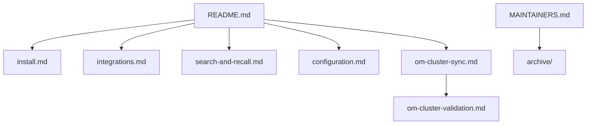

# Documentation

This folder holds the longer guides for Observational Memory. The main README is the quick doorway. These pages go deeper.

## Start Here

- [Install and setup](install.md): install paths, first run, and platform notes.
- [Platform integrations](integrations.md): Claude Code, Codex, Cowork, Hermes, ChatGPT, and Claude Managed Agents.
- [Search, recall, and startup context](search-and-recall.md): how `om context`, `om recall`, and `om search` fit together.
- [Configuration](configuration.md): env file, provider auth, model choices, schedules, paths, and search backends.

## Sync And Memory Safety

- [OM Cluster sync](om-cluster-sync.md): encrypted multi-machine sync.
- [OM Cluster validation checklist](om-cluster-validation.md): public-safe validation steps.
- [Host memory coexistence](coexistence.md): how OM fits beside product memory systems.
- [OM Cluster P2P evaluation](om-cluster-p2p-evaluation.md): current direct-peer design notes.

## Maintainers

- [Maintainer guide](MAINTAINERS.md): development, CI, QMD validation, release, and Homebrew work.
- [v0.6.2 release notes](RELEASE-0.6.2.md): current release summary.

## Archive

Completed implementation plans and old status reports live under [archive/](archive/). They are kept for history, but current docs should link to the guides above.

