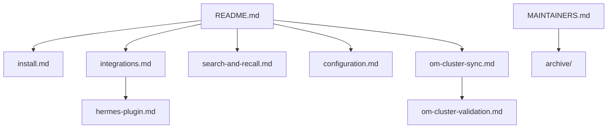

# Documentation

This folder holds the longer guides for Observational Memory. The main README is the quick doorway. These pages go deeper.

## Start Here

- [Install and setup](install.md): install paths, first run, and platform notes.
- [Platform integrations](integrations.md): Claude Code, Codex, OpenCode, Kimi, Grok, Cowork, Hermes, ChatGPT, and Claude Managed Agents.
- [Hermes plugin](hermes-plugin.md): standalone Hermes memory-provider setup and OM Cluster validation.
- [Search, recall, and startup context](search-and-recall.md): how `om context`, `om recall`, and `om search` fit together.
- [Talk to your memories](talk-to-memories.md): `om talk` — a conversation grounded in background recall, with an optional Moss backend.
- [Configuration](configuration.md): env file, provider auth, model choices, schedules, paths, and search backends.

## Sync And Memory Safety

- [OM Cluster sync](om-cluster-sync.md): encrypted multi-machine sync.
- [OM Mail](mail-memory.md): email inboxes as a memory substrate between agents (experimental).
- [OM Cluster validation checklist](om-cluster-validation.md): public-safe validation steps.
- [Host memory coexistence](coexistence.md): how OM fits beside product memory systems.
- [OM Cluster P2P evaluation](om-cluster-p2p-evaluation.md): current direct-peer design notes.

## Maintainers

- [Maintainer guide](MAINTAINERS.md): development, CI, QMD validation, release, and Homebrew work.
- [v0.9.1 release notes](RELEASE-0.9.1.md): current release - Claude checkpoints in the bounded lane, streaming transcript scans, and a worker memory ceiling.
- [v0.9.0 release notes](RELEASE-0.9.0.md): OpenCode and Kimi support plus bounded background observers.
- [v0.8.0 release notes](RELEASE-0.8.0.md): durable, provable, conversational memory plus the OM Mail preview.
- [v0.7.0 release notes](RELEASE-0.7.0.md): section-targeted reflection at scale.
- [v0.6.7 release notes](RELEASE-0.6.7.md): reflector budgets and output caps.

## Archive

Completed implementation plans and old status reports live under [archive/](archive/). They are kept for history, but current docs should link to the guides above.

